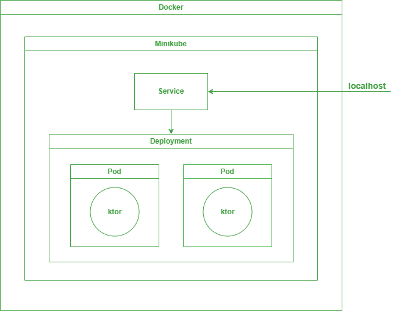

# Create your first full-stack application with k8s

## Create ktor server application
1. [Ktor project generator](https://ktor.io/create/)
2. Add `Routing` & `Kotlinx.Serialization` dependencies
3. Create two simple route 
4. [Configure docker](https://ktor.io/docs/docker.html#manual)

## Create simple android app for testing 
1. Create Compose Android app
2. Add dependencies for http interaction
3. Create simple screen
4. Create Api with 2 endpoints
5. [Connect to computer's localhost](https://stackoverflow.com/questions/5495534/java-net-connectexception-localhost-127-0-0-18080-connection-refused)
6. Get users from ktor server
7. Create new user at server

## How to create docker container?
1. Create Dockerfile
```Dockerfile
FROM openjdk:17-jdk-alpine3.14
RUN mkdir /app
COPY ./build/libs/com.example.ktor-sample-all.jar /app/app.jar
ENTRYPOINT ["java","-jar","/app/app.jar"]
EXPOSE 8080
```

2. Build your app
`./gradlew build`
or run task `assemble` in your IDE to create jar file
3. Build docker container
`docker build .`
4. You can test your containter with command
`docker run -it -p 8080:8080  ktor-sample`
```
2023-12-10 17:14:23.025 [main] INFO  ktor.application - Autoreload is disabled because the development mode is off.
2023-12-10 17:14:23.382 [main] INFO  ktor.application - Application started in 0.391 seconds.
2023-12-10 17:14:23.507 [DefaultDispatcher-worker-1] INFO  ktor.application - Responding at http://0.0.0.0:8080
```

## How to push your image? 
> Because minikube don't who is and where is your local container we need to push it do docker hub or [provide it to minikube](https://www.baeldung.com/docker-local-images-minikube). I choose first solution.
1. Log in to your docker-hub account `docker login -u your login`
2. And try to push an image `docker push your login/your container name`
```
An image does not exist locally with the tag: ...
```
3. Tag your image `docker tag ktor-sample your login/your container name`
4. Push it! `docker push your login/your container name`
5. And now minikube can access your image! For example, `qveex/ktor-sample:latest`


## How to run ktor with k8s?
> You can create alias for kubectl command `alias kubectl="minikube kubectl --`
1. Create Deployment and Service manifest:
```yaml
apiVersion: apps/v1
kind: Deployment
metadata:
  name: sample-deployment
spec:
  replicas: 2
  selector:
    matchLabels:
      app: sample-deployment
  template:
    metadata:
      labels:
        app: sample-deployment
    spec:
      containers:
        - name: sample-ktor
          image: qveex/ktor-sample:latest
          ports:
            - name: container-port
              containerPort: 8080

---

apiVersion: v1
kind: Service
metadata:
  name: sample-service
spec:
  type: LoadBalancer
  selector:
    app: sample-deployment
  ports:
  - port: 8080
    targetPort: container-port
```

2. Apply our manifest to create components `kubectl apply -f deployment.yaml`
3. Check your pods `kubectl get pods`
4. For more details we can use command `kubectl descripe pod pod-name`
5. Open port `kubectl port-forward service/sample-service 8080:8080` OR `minikube service sample-service` or `minikube tunnel` and **don't close console**
6. Now you can access to your ktor application
7. lets test it - with postman or with our app
```json
[
   {
      "id":1,
      "name":"Misha",
      "age":22
   },
   {
      "id":2,
      "name":"Alexandr",
      "age":25
   },
   {
      "id":3,
      "name":"Rakhim",
      "age":22
   }
]
```
> [Documentation](https://kubernetes.io/docs/tasks/access-application-cluster/connecting-frontend-backend/)

## To update image
1. Do changes
2. Rebuild your app
3. Rebuild new docker image
4. Push new image to docker hub
5. Also you can clear old containers to let Kubernetes definitely know that a new container needs to be used

## Result of our work
